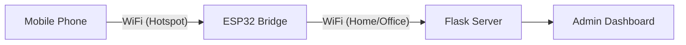

#  Artemis GPS & IMU Tracker


> **A real-time tracking system capable of capturing GPS and Sensor data from mobile devices via ESP32, visualizing it instantly on a sleek Admin Dashboard.**

---

##  System Architecture

This system acts as a bridge between mobile devices and a central server, ensuring seamless data flow even in complex network environments.



| Component | Role | Network IP |
|-----------|------|------------|
| ** Phone** | Sends GPS/IMU Data | `192.168.4.x` |
| ** ESP32** | Bridge (AP + Station) | `192.168.4.1` (AP) |
| ** Server** | Data Processing | `10.101.79.87` (Example) |

---

##  Quick Start Guide

### 1 Configure Firmware
Open `src/config.h` and update your network credentials:

```cpp
//  PART 1: ESP32 Hotspot (Your phone connects here)
const char *WIFI_SSID = "ESP32"; 
const char *WIFI_PASSWORD = "12345678";

//  PART 2: Internet/Server Connection (ESP32 connects here)
const char *HOME_WIFI_SSID = "your_wifi_name";
const char *HOME_WIFI_PASSWORD = "your_wifi_password";

//  PART 3: Backend Server
const char *FLASK_SERVER_IP = "192.168.x.x"; // Run 'ipconfig' on laptop
```

### 2 Flash the ESP32
Connect your board and upload the firmware via PlatformIO:
> **Task:** `PlatformIO: Upload`

### 3 Launch the Server
Start the backend dashboard on your computer:
```powershell
# Windows
.\start_server.bat
```
*The dashboard will launch at: `http://localhost:5000`*

---

##  Usage Instructions

###  For Users (Mobile)
1.  Connect your phone to WiFi: **`ESP32`** (Pass: `12345678`)
2.  Open Browser: **[http://192.168.4.1](http://192.168.4.1)**
3.  Enter a username and toggle **"Start Sharing"**.

###  For Admins (Dashboard)
1.  Ensure laptop is connected to the **Home WiFi**.
2.  Open Browser: **[http://localhost:5000](http://localhost:5000)**
3.  Watch devices appear on the map in real-time! 

---

##  Troubleshooting

<details>
<summary><b> ESP32 not connecting to Home WiFi?</b></summary>

*   **Bandwidth:** Use **2.4GHz** WiFi only (5GHz is not supported).
*   **Credentials:** Double-check `HOME_WIFI_SSID` and password in `config.h`.
*   **Range:** Ensure ESP32 is close to the router/hotspot.
</details>

<details>
<summary><b> Dashboard not showing data?</b></summary>

*   **IP Mismatch:** Ensure `FLASK_SERVER_IP` in code matches your laptop's actual IP.
*   **Firewall:** Allow **Python** through Windows Defender Firewall (Port 5000).
*   **Network:** Laptop and ESP32 must be on the **same** network.
</details>

<details>
<summary><b> Phone browser won't load?</b></summary>

*   **Connection:** Verify phone is connected to `ESP32` WiFi.
*   **Mobile Data:** Turn off mobile data (4G/5G) if page fails to load.
</details>

---

##  Project Structure

```bash
 Project Root
   src            #  ESP32 Firmware Source
    main.cpp     #    - Core Logic
    config.h     #    - Configuration Settings
   flask_server   #  Backend Server
    app.py       #    - Flask App
    templates    #    - Dashboard UI
   dashboard      #  Mobile App Files
   platformio.ini #  Board Config
   README.md      #  Documentation
```

---
*Built with  using PlatformIO, ESP32, and Flask.*
